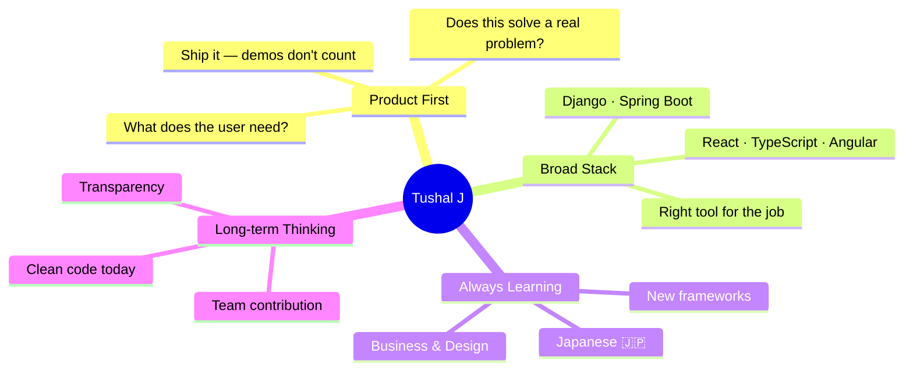

<div align="center">


</div>

---

### 👋 Hey, I'm Tushal

I'm a final-year Computer Science student at Anna University building production software while still in college. I think about problems first, technology second — my projects are live because I built things people actually needed, not just for a portfolio.

Currently interning at **ZakApps** shipping production React + TypeScript apps and Spring Boot features daily. Actively learning Japanese 🇯🇵 and working towards relocating to Japan.

---

### 🚀 What I'm Working On

- 🔗 **[LinkdPlus](https://github.com/Tushal27/LinkdPlus-Frontend)** — A career social platform. Live, with real users. React + Django REST + JWT + PostgreSQL
- 👓 **[Glarix](https://github.com/Tushal27/glarix)** — Multi-tenant eyewear SaaS built solo end-to-end
- 🛍️ **[Bhawani Enterprises](https://bhawanienterprise.co.in)** — Client-facing product catalogue, live at bhawanienterprise.co.in

---

### 🛠️ Tech Stack

<div align="center">

**Frontend**


**Backend**


**Database & Cloud**


**DevOps & Tools**


**AI-Augmented Dev**


</div>

---

### 📈 Activity

<div align="center">

[](https://github.com/Tushal27)

</div>

---

### 🗺️ My Engineering Philosophy



---

### 🌟 Featured Projects

| Project | Stack | Live |
|---------|-------|------|
| 🔗 [**LinkdPlus**](https://github.com/Tushal27/LinkdPlus-Frontend) — Career social platform | React · Django REST · JWT · PostgreSQL | [🌐 Open](https://linkd-plus-frontend.vercel.app) |
| 👓 [**Glarix**](https://github.com/Tushal27/glarix) — Multi-tenant eyewear SaaS | React · Django REST · Cloudinary · Tailwind | 🟢 Live |
| 🛍️ **Bhawani Enterprises** — Product catalogue | React · Supabase · PostgreSQL | [🌐 Open](https://bhawanienterprise.co.in) |

---

### 🌏 About Me

```python
tushal = {
    "location":     "Chennai, India 🇮🇳 → Japan 🇯🇵 (relocating)",
    "education":    "B.E. Computer Science, Anna University (GPA: 8.46)",
    "current_role": "Software Engineering Intern @ ZakApps",
    "languages":    ["English", "Tamil", "Hindi", "Japanese (学習中)"],
    "interests":    ["Product development", "Developer tools", "UI/UX"],
    "philosophy":   "Not which tech — but what it solves for the user.",
    "open_to":      "New grad engineer roles in Japan (2027)",
}
```

---

### 📬 Connect

<div align="center">

[](https://linkedin.com/in/tushal-j)
[](mailto:rajtushal74@gmail.com)
[](https://linkd-plus-frontend.vercel.app)

</div>

<div align="center">


</div>
