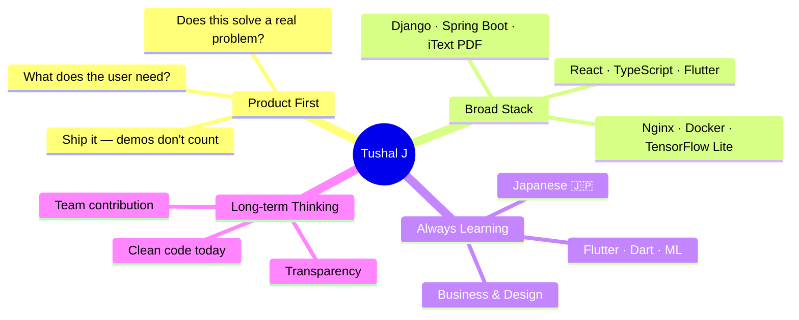

<div align="center">


</div>

---

# Hi, I'm Tushal 👋

**Software Engineer @ ZakApps** · Full-stack & AI engineering · Chennai, India → open to Japan

I build and own production systems end to end: an employee-onboarding platform serving
950+ employees across the UK, Ireland and France, with AI document verification and
contract generation.

<div align="center">

```ruby
    ┌─────────────────────────────────────────────────┐
     tushal@github
    └─────────────────────────────────────────────────┘
     ❯ OS ............: India 🇮🇳 ➜ Japan 🇯🇵 (relocating)
     ❯ Host ..........: ZakApps — Software Engineer
     ❯ Kernel ........: Full-Stack & AI Engineer · Product-First
     ❯ Uptime ........: B.E. CSE, Anna University (GPA 8.46)
    ───────────────────────────────────────────────────
     ❯ Languages.Code : TypeScript, Python, Java, Dart, JS
     ❯ Languages.Real : English, Tamil, Hindi, 日本語 (学習中)
     ❯ IDE ...........: VS Code · IntelliJ IDEA
    ───────────────────────────────────────────────────
     ❯ Frontend ......: React, TypeScript, Flutter, Tailwind
     ❯ Backend .......: Django REST, Spring Boot, Node
     ❯ Data & Cloud ..: PostgreSQL, Redis, Supabase, Docker
    ───────────────────────────────────────────────────
     ❯ Email .........: rajtushal74@gmail.com
     ❯ LinkedIn ......: /in/tushal-j
     ❯ LeetCode ......: /u/tushal2712
```

</div>

---

I'm a Software Engineer at ZakApps in Chennai building production software. I think about problems first, technology second — my projects are live because I built things people actually needed, not just for a portfolio.

Building production onboarding and AI systems at **ZakApps**, shipping React + TypeScript apps, Spring Boot PDF generation features, and Redis OTP systems daily. Actively learning Japanese 🇯🇵 and working towards relocating to Japan.

---

### 🚀 Products I've Built and Run

- 🛡️ **[SafeSnap](https://github.com/Tushal27/SafeSnap)** — on-device AI image safety for children's phones; images never leave the device. [Parent dashboard](https://safesnap.vercel.app) · [Android app download](https://safesnap-app.vercel.app). Flutter · Spring Boot · React · TensorFlow Lite
- 🧠 **[Lattice](https://github.com/Tushal27/Lattice)** — a personal "second brain": knowledge graph, spaced daily review and an AI agent. [Live demo](https://lattice-demo-ai.vercel.app). Next.js · TypeScript · Prisma
- 📱 **ZeroNihongo** — native Android app for JLPT N5: offline SM-2 spaced repetition, an AI tutor with streaming replies, and quizzes generated from what you've actually studied; Spring Boot backend on GCP Cloud Run. Google Play: in testing · [website](https://zeronihongo.com) · source private. Kotlin · Jetpack Compose · Spring Boot

### 🔬 Engineering Project

- 🔎 **[Hybrid product search](https://github.com/Tushal27/hybrid-product-search)** — semantic + keyword search with a reranker over 890,837 products, scored against human relevance labels with confidence intervals, load-tested (the first version collapsed at 3 req/s; the rewrite refuses excess load instead). Python · FAISS · FastAPI · Docker · GitHub Actions

### 🤝 Client Work

- 🛍️ **Bhawani Enterprises** — product catalogue built for a client (React · Supabase). The hosted backend is currently offline, so this one is source-only: [code](https://github.com/Tushal27/bhawani-enterprises).

### 🗄️ Archived Projects

- 🔗 **[LinkdPlus](https://github.com/Tushal27/LinkdPlus-Frontend)** ([backend](https://github.com/Tushal27/LinkdPLus_backend)) — a career social platform built solo: React · Django REST · JWT · PostgreSQL. Archived: the hosted backend is offline, so it is source-only.

---

### 🛠️ Tech Stack

<div align="center">

**Frontend**


**Backend**


**Database & Cloud**


**Mobile & ML**


**DevOps & Tools**


**AI-Augmented Dev**


</div>

---

### 📈 Activity

<div align="center">

[


](https://github.com/Tushal27)

</div>

---

### 🗺️ My Engineering Philosophy


```mermaid
mindmap
  root((Tushal J))
    Product First
      What does the user need?
      Does this solve a real problem?
      Ship it — demos don't count
    Broad Stack
      React · TypeScript · Flutter
      Django · Spring Boot · iText PDF
      Nginx · Docker · TensorFlow Lite
    Always Learning
      Japanese 🇯🇵
      Flutter · Dart · ML
      Business & Design
    Long-term Thinking
      Clean code today
      Team contribution
      Transparency
```

---

### 🌟 Featured Projects

| Project | Stack | Live |
|---------|-------|------|
| 🔎 [**Hybrid product search**](https://github.com/Tushal27/hybrid-product-search) — 890k products, evaluated + load-tested | Python · FAISS · PyTorch · FastAPI · Docker · CI | 🟢 Built, [📊 results](https://github.com/Tushal27/hybrid-product-search#search-quality) |
| 🔗 [**LinkdPlus**](https://github.com/Tushal27/LinkdPlus-Frontend) — Career social platform | React · Django REST · JWT · PostgreSQL | Archived (backend offline) |
| 🛡️ [**SafeSnap**](https://github.com/Tushal27/SafeSnap) — On-device AI child safety | Flutter · Spring Boot · React · TFLite | [🌐 Dashboard](https://safesnap.vercel.app) · [📱 App](https://safesnap-app.vercel.app) |
| 🛍️ **Bhawani Enterprises** — Product catalogue (client project) | React · Supabase · PostgreSQL | Archived (backend offline) |
| 🧠 [**Lattice**](https://github.com/Tushal27/lattice) — Personal knowledge system ("second brain") with a knowledge graph, spaced daily review and an AI agent | Next.js · React · TypeScript · Prisma · libSQL/Turso | [🌐 Open](https://lattice-demo-ai.vercel.app) |
| 📱 [**ZeroNihongo**](https://zeronihongo.com) — Japanese-learning Android app (SM-2, AI tutor) | Kotlin · Jetpack Compose · Spring Boot · GCP Cloud Run | 🧪 In testing on Google Play · source private |

---

### 🌏 About Me

```python
tushal = {
    "location":     "Chennai, India 🇮🇳 → Japan 🇯🇵 (relocating)",
    "education":    "B.E. Computer Science, Anna University (GPA: 8.46)",
    "current_role": "Software Engineer @ ZakApps",
    "languages":    ["English", "Tamil", "Hindi", "Japanese (学習中)"],
    "stack":        ["React", "TypeScript", "Flutter", "Spring Boot", "Django"],
    "interests":    ["Product development", "Child safety tech", "UI/UX"],
    "philosophy":   "Not which tech — but what it solves for the user.",
    "open_to":      "Software engineer roles in Japan",
}
```

---

### 📬 Connect

<div align="center">

[


](https://linkedin.com/in/tushal-j)
[


](mailto:rajtushal74@gmail.com)
[


](https://leetcode.com/u/tushal2712)

</div>

<div align="center">


</div>
